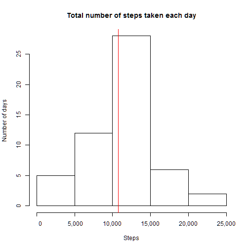
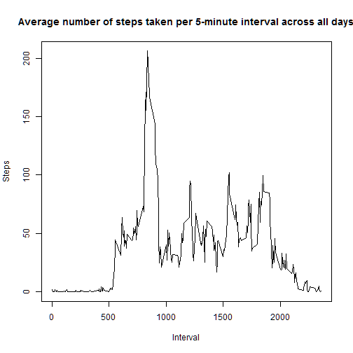
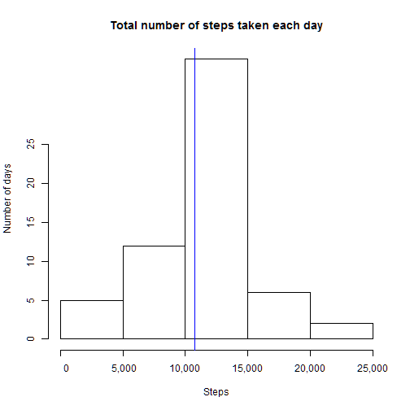
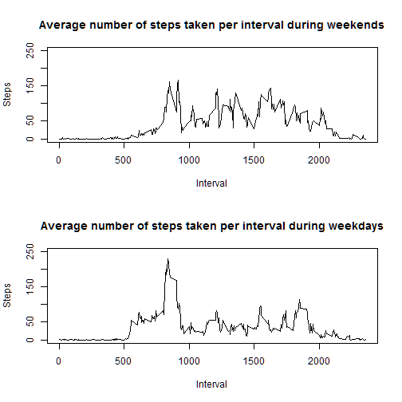

# Reproducible Research: Peer Assessment 1


## Loading and preprocessing the data


```r
if(!file.exists("activity.csv")) unzip("activity.zip")
activity <- read.csv("activity.csv", colClasses=c("integer", "Date", "integer"))
head(activity)
```

```
##   steps       date interval
## 1    NA 2012-10-01        0
## 2    NA 2012-10-01        5
## 3    NA 2012-10-01       10
## 4    NA 2012-10-01       15
## 5    NA 2012-10-01       20
## 6    NA 2012-10-01       25
```

## What is mean total number of steps taken per day?


```r
totals <- with(activity, tapply(steps, date, sum, na.rm=F))
hist(totals, main="Total number of steps taken each day", xlab="Steps", ylab="Number of days", axes=F)
axis(1, seq(0, 25000, 5000), labels=prettyNum(seq(0, 25000, 5000), big.mark=",", scientific=F))
axis(2, seq(0, 25, 5))
m1 <- mean(totals, na.rm=T)
m2 <- median(totals, na.rm=T)
abline(v=m1, col="red")
```

 

The mean total number of steps taken per day is 10,766 (indicated by the red bar in the plot above) and the median is 10,765.

## What is the average daily activity pattern?


```r
means <- with(activity, tapply(steps, interval, mean, na.rm=T))
plot(as.integer(names(means)), means, type="l", xlab="Interval", ylab="Steps", main="Average number of steps taken per 5-minute interval across all days")
```

 

```r
means.max <- which.max(means)
```

The maximum average number of steps taken per 5-minute interval across all days was 104 and occurred in interval 835.

## Imputing missing values

We shall impute missing values using the average number of steps taken per 5-minute interval across all days.


```r
new.activity <- activity
for(i in 1:nrow(new.activity)) 
        new.activity$steps[i] <- ifelse(is.na(new.activity$steps[i]), means[as.character(new.activity$interval[i])], new.activity$steps[i])
head(new.activity)
```

```
##     steps       date interval
## 1 1.71698 2012-10-01        0
## 2 0.33962 2012-10-01        5
## 3 0.13208 2012-10-01       10
## 4 0.15094 2012-10-01       15
## 5 0.07547 2012-10-01       20
## 6 2.09434 2012-10-01       25
```

```r
new.totals <- with(new.activity, tapply(steps, date, sum, na.rm=F))
hist(new.totals, main="Total number of steps taken each day", xlab="Steps", ylab="Number of days", axes=F)
axis(1, seq(0, 25000, 5000), labels=prettyNum(seq(0, 25000, 5000), big.mark=",", scientific=F))
axis(2, seq(0, 25, 5))
new.m1 <- mean(new.totals, na.rm=T)
new.m2 <- median(new.totals, na.rm=T)
abline(v=new.m1, col="blue")
```

 

After imputting missing values in this way, the mean total number of steps taken per day is 10,766 (indicated by the blue bar in the plot above) and the median is 10,766, i.e., only the median is a little changed.

## Are there differences in activity patterns between weekdays and weekends?


```r
new.activity <- transform(new.activity, weekday = weekdays(date, abbreviate=T))
new.activity <- transform(new.activity, weekday = sub("Sat|Sun", "weekend", weekday))
new.activity <- transform(new.activity, weekday = sub("Mon|Tue|Wed|Thu|Fri", "weekday", weekday))
new.activity$weekday <- as.factor(new.activity$weekday)
new.means <- with(new.activity, tapply(steps, list(weekday, interval), mean))
par(mfrow=c(2,1))
plot(names(new.means[2,]), new.means[2,], type="l", xlab="Interval", ylab="Steps", main="Average number of steps taken per interval during weekends", ylim = c(0, 250))
plot(names(new.means[1,]), new.means[1,], type="l", xlab="Interval", ylab="Steps", main="Average number of steps taken per interval during weekdays", ylim = c(0, 250))
```

 

The average number of steps taken per interval during the earlier part of the day is lower on weekends than on weekdays. This is perhaps due to the absence of a commute during weekends. The average numnber of steps taken per interval during the later of the day is higher on weekends than on weekdays. This is perhaps due to not being tied to a desk during weekends.  The average total number of steps taken is 12,202 during weekends and 10,256 during weekdays.
